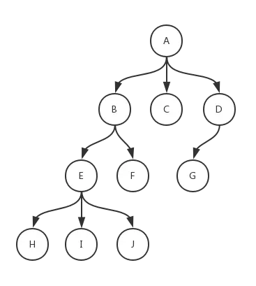

# 树的遍历
不妨假设每个节点的值是一个字符串<br>

```go
type TreeNode struct {
	Children []*TreeNode
	Val string
}
```
* [BFS层次遍历](tree-traversal/levelorder.go)
* [DFS深度遍历](tree-traversal/preorder.go)
## 二叉树
对于二叉树，DFS又可细分为前序、中序、后序遍历
* [层次遍历](../solutions/binary-tree-level-order-traversal/d.go)
* [先序遍历](../solutions/binary-tree-preorder-traversal/d.go)
* [中序遍历](../solutions/binary-tree-inorder-traversal/d.go)
* [后序遍历](../solutions/binary-tree-postorder-traversal/d.go)